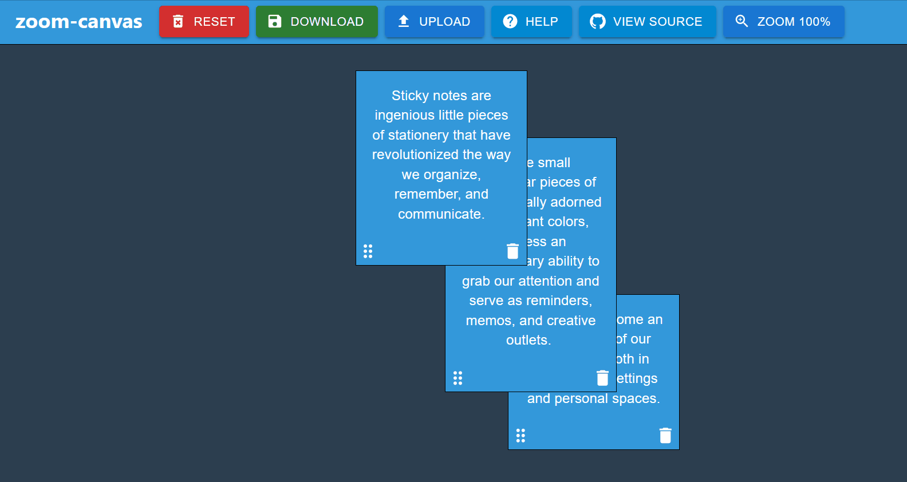

# zoom-canvas

## What is zoom-canvas?

__zoom-canvas__ allows the user to create sticky notes, but with the freedom of panning and zooming around.

## Design

__zoom-canvas__ is made using React and [Material UI](https://mui.com/material-ui/). This project was bootstrapped with [Create React App](https://github.com/facebook/create-react-app).

## Development
### Available Scripts
#### `npm start`

Runs the app in the development mode.\
Open [http://localhost:3000](http://localhost:3000) to view it in the browser.

The page will reload if you make edits.\
You will also see any lint errors in the console.

#### `npm run lint`
#### `npm run lint:fix`

This project uses [prettier](https://prettier.io/) for code formatting. This keeps the format consistent and straightforward to maintain. Run `npm run lint` to see lint issues, and `npm run lint:fix` to fix what can be automatically fixed.

